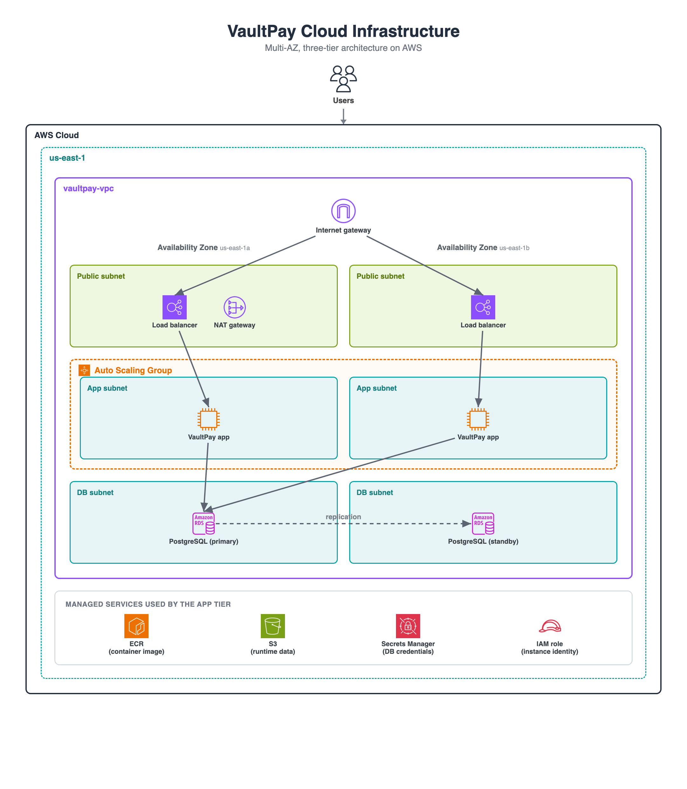

<!--
README TEMPLATE for your VaultPay repo.
It is already filled in for the standard build. To use it:
  1. Copy this whole file into your repo as README.md
  2. Replace the spots flagged in the HTML comments with your own details
  3. Delete those comment lines, then commit and push
Adjust anything that differs from your actual repo.
-->

# VaultPay Cloud Infrastructure

Production-style AWS infrastructure for a FinTech transaction platform, built entirely with Terraform.
<!-- swap this line for your own one-sentence description if your project is different -->


<!-- put your architecture diagram in a docs/ folder as architecture.png, or change the path above -->

## Overview

VaultPay is a FinTech platform that processes financial transactions for businesses, so the infrastructure is built around two priorities: staying available, and keeping customer financial data locked down. This repository holds the complete AWS environment for it, defined as code with Terraform so it can be stood up or torn down on demand.

## How it works

A customer request comes in through an Application Load Balancer in the public subnets, which spreads it across a group of application servers running the VaultPay app in Docker containers. Those servers sit in private subnets with no direct access from the internet, and they read and write to a managed PostgreSQL database in isolated private subnets. The whole environment runs across two Availability Zones for redundancy.

## Key design decisions

- **The database is isolated.** PostgreSQL sits in a private subnet with no route to the internet, reachable only from the application tier through a least-privilege security group.
- **Only the load balancer is public.** The app servers and the database are private, so the load balancer is the single public entry point.
- **No secrets in the code.** Database credentials live in AWS Secrets Manager and are fetched by the app at runtime, so no password is committed or stored on a server.
- **No SSH.** Instances are reached through AWS Systems Manager Session Manager with an IAM instance role, so there are no key pairs to manage and port 22 is never open.
- **Encrypted at rest.** The RDS database has storage encryption enabled, so the financial data is protected on disk, not just kept off the public internet.
- **Highly available.** The application runs behind an Auto Scaling Group that keeps two instances healthy across two Availability Zones and automatically replaces any that fail.

## Built with

- **AWS:** VPC, EC2 Auto Scaling, Application Load Balancer, RDS (PostgreSQL), Secrets Manager, ECR, IAM, Systems Manager (Session Manager), S3
- **Terraform** for all infrastructure
- **Docker** for the application image

## Project structure

```text
.
├── main.tf                     # wires the modules together
├── variables.tf
├── outputs.tf
├── data.tf                     # data sources (AMI lookup, etc.)
├── backend.tf                  # remote state in S3
├── terraform.tfvars            # config values, no secrets (committed)
├── env_vars/                   # per-environment values (committed)
│   ├── dev.tfvars
│   └── prod.tfvars
└── modules/
    ├── vpc/                    # network: subnets, routing, gateways
    ├── database/              # RDS instance, subnet group, security group
    └── application/           # ALB, launch template, auto scaling group, ECR, IAM role, S3 runtime bucket
```
<!-- adjust this tree to match your actual repo layout -->

## Deploy it

Prerequisites:

- An AWS account, the AWS CLI configured, and Terraform installed.
- An S3 bucket for Terraform state, with its name set in `backend.tf`.
- The app image built and pushed to the ECR repository this stack creates (run `terraform apply` once to create the empty repo, then push your image).

```bash
terraform init
terraform plan  -var-file=env_vars/dev.tfvars
terraform apply -var-file=env_vars/dev.tfvars
```

## What I would build next

- HTTPS on the load balancer with an ACM certificate
- A CI/CD pipeline to deploy on every push
- Centralized logging and monitoring
<!-- keep the ones you actually plan to do, or add your own -->

---

Built by <!-- your name --> as a portfolio project.
<!-- optional: add a link to your LinkedIn -->
